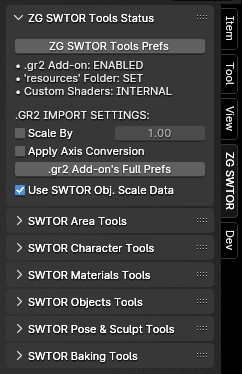

# ZeroGravitas' SWTOR Tools.
## Blender 4.3 breaks our SWTOR materials-processing tools! Stay on 4.2 or earlier.
## SWTOR Game Update 7.6' modernized skin materials broke our Character Assembler tool. Try the **[v2.0.5 Beta release](https://github.com/SWTOR-Slicers/ZG-SWTOR-Tools/releases/tag/2.0.4)** that solves that and other issues (WARNING: its use replaces a PC/NPC folder's already existing textures with current ones, classic or modernized. If wanting to preserve them, use the tool in a copy or a newly decompressed .zip).

---

### [Download the latest release](https://github.com/SWTOR-Slicers/ZG-SWTOR-Tools/releases/latest) (not compatible with Game Update 7.6!).
### (Make sure to download the latest [.gr2 Importer Add-on](https://github.com/SWTOR-Slicers/Granny2-Plug-In-Blender-2.8x))

---

**This Blender Add-on provides with a miscellanea of tools to import, assemble, texture and improve upon Star Wars: The Old Republic's game assets. It grows in features as new ideas come up. Quality of code-wise, "this is not a place of honor": It Just (Kinda) Works™.**

**This Add-on relies on foundational efforts by fellow slicers, such as the [.gr2 Importer Addon](https://github.com/SWTOR-Slicers/WikiPedia/wiki/ZG-SWTOR-https://github.com/SWTOR-Slicers/Granny2-Plug-In-Blender-2.8x), which works under the hood in places, and the [Slicers GUI Tool](https://github.com/SWTOR-Slicers/WikiPedia/wiki/ZG-SWTOR-https://github.com/SWTOR-Slicers/Slicers-GUI), which allows for extracting the game assets we play with, plus game information exported by tools in [Jedipedia.net](https://https://swtor.jedipedia.net/en) and [TORCommunity.com](https://torcommunity.com/).**

### Check the [ZG SWTOR Tools' pages in our Wiki](https://github.com/SWTOR-Slicers/WikiPedia/wiki/ZG-SWTOR-Tools-Add-on) for installation instructions and each tool's user guide.

 

## Recent changes:
2024-09

* Minor corrections in the Merge Doubles (Edit Mode) tool for compatibility with Blender 4.1 and higher.

2024-07:

* Compatibility with Blender 4.0.x (depends on the .gr2 Importer Add-on's own compatibility).
* The Add-on interacts with the .gr2 Importer Add-on's new features, exposing some of them in the Status Panel. Several Objects Tools use them (see Object Tools page's prologue).
* Area Assembler:
  * Corrects a bug in its instancer code (responsible for duplicating already imported objects to speed up assembling): now **more objects ought to land in their correct places** instead of ending up floating around at random.
  * **Terrains no longer show fissures thanks to an improved SWTOR Terrain Extractor. please download it and regenerate your terrains with it**.
  * **NEW: It assembles 64-bit SpeedTrees** now, filling a Tython or a Dromund Kaas with trees.
  * **Makes sure whole imported areas are consistently placed relative to the scene's origin**. In theory, merging partial Area Assemblies into a final scene wwith everything fitting correctly ought to be possible.
* Group Areas in Subcollections: works far better and easier now.
* Character Assembler (in combination with improvements in the .gr2 Importer Add-on):
  * Solves an issue with NPCs' skin areas showing armor material instead of skin.
  * **NEW: it pplies DirectionMaps to hair and fur**.
  * Corrects an issue with Twi'lek eyes' UVs that kept them from baking correctly.
  * **NEW: it can separate the eyes into a different object**, which some third party rigging systems prefer.
  * **NEW: it can make each eye a separate object**, adjusting their origins so that we can control them with both bones and conventional rotations at once.
* **NEW: Merge Physics Bones' Vertex Groups**: helps with Cloth Physics applications.
* **NEW: Set Objects' Properties Manually**: for management of .gr2 object properties (nothing to see here, move along).
* **NEW: Clear bone Translations**: to solve imported animations and poses' distorted limbs.
* **NEW: Correct Twi'lek eyes' UVs.**: same as in the Character Assembler, but applicable to already imported models.
