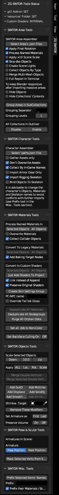

# ZeroGravitas' SWTOR Tools.

### WARNING: this tool isn't yet compatible with Blender 4.x.
---

## Download the latest release [here](https://github.com/SWTOR-Slicers/ZG-SWTOR-Tools/releases/latest).

---
**This Blender Add-on provides with a miscellanea of tools to import, assemble, texture and improve upon Star Wars: The Old Republic's game assets. It grows in features as new ideas come up. Quality of code-wise, "this is not a place of honor": It Just (Kinda) Works™.**

**This Add-on relies on foundational efforts of fellow slicers, such as the [.gr2 Importer Addon](https://github.com/SWTOR-Slicers/Granny2-Plug-In-Blender-2.8x), which works under the hood providing major importing functionality in places, and the [Slicers GUI Tool](https://github.com/SWTOR-Slicers/Slicers-GUI), which makes extracting SWTOR's game assets possible.**

**Check the [ZG SWTOR Tools' pages in our Wiki](https://github.com/SWTOR-Slicers/WikiPedia/wiki/ZG-SWTOR-Tools-Add-on) for installation instructions and each tool's user guide.**

## Recent changes in v.1.4

* Integrated Area and Character Assembler Tools, with better error catching.
* For convenience, the customizable SWTOR shaders template file resides in the Add-on now and doesn't require a separate download. Selecting an external version is still possible through the Add-on's Preferences.
* Conversion to Legacy materials for easier baking.
* Sundry User Interface changes (subpanel organization, tooltips…).

