# ZeroGravitas' SWTOR Tools.

Changelog v1.1:
* New Character's Skin Settings "control panel" Nodegroup.
* New Deduplicate Materials tool and orphan data purger.

This Blender Add-on provides with a miscellanea of tools to use on **Star Wars: The Old Republic**'s game assets, including an Uber Materials Processor for static game models. It will grow in features as new ideas come up. Quality of code-wise, "this is not a place of honor": It Just (Hardly) Works™.

- [ZeroGravitas' SWTOR Tools.](#zerogravitas-swtor-tools)
  - [Installation:](#installation)
  - [SWTOR Materials Tools:](#swtor-materials-tools)
    - [Process Uber Materials.](#process-uber-materials)
    - [Customizable SWTOR Shaders.](#customizable-swtor-shaders)
      - [Add Custom SWTOR Shaders:](#add-custom-swtor-shaders)
      - [Convert to Custom SWTOR Shaders:](#convert-to-custom-swtor-shaders)
      - [About the included custom shaders:](#about-the-included-custom-shaders)
      - [Custom Shader Extras:](#custom-shader-extras)
      - [About the beta state:](#about-the-beta-state)
    - [Character's Skin Settings "control panel" Nodegroup.](#characters-skin-settings-control-panel-nodegroup)
      - [In the 3D Viewer:](#in-the-3d-viewer)
      - [In the Shader Editor:](#in-the-shader-editor)
    - [Deduplicate Scene's Materials and Nodegroups.](#deduplicate-scenes-materials-and-nodegroups)
    - [Set Backface Culling On/Off.](#set-backface-culling-onoff)
  - [SWTOR Objects Tools:](#swtor-objects-tools)
    - [Quickscaler.](#quickscaler)
    - [Merge Double Vertices.](#merge-double-vertices)
    - [Modifiers Tools.](#modifiers-tools)
  - [SWTOR Misc. Tools:](#swtor-misc-tools)
    - [Set all .dds to Raw/Packed.](#set-all-dds-to-rawpacked)
    - [Simplify.](#simplify)
    - [Pose Position / Rest Position.](#pose-position--rest-position)
    - [Camera to View.](#camera-to-view)

## Installation:

The installation of the Add-on in Blender is quite simple:

1. [**Download the Add-on's "zg_swtors_tool.zip" file from this link**](/zg_swtor_tools.zip). Don't unZip it: it's used as such .zip.
2. [**Download the "custom_swtor_shaders.blend.zip" file from this link**](/custom_swtor_shaders.blend.zip). UnZip this one and keep the resulting Blender file somewhere in handy. **This file is only necessary if we intend to play with the Custom SWTOR Shaders tools, currently in beta**.
3. In Blender, go to `Edit menu > Preferences option > Add-ons tab > Install… button`.
4. Select the Add-on in the file dialog box and click on the `Install Add-on button`.
5. The Add-on will appear in the Add-ons list with its checkbox un-ticked. Tick it to enable the Add-on.
6. Twirl the arrow preceding the check-box to reveal some information and, most importantly, **the Add-on's Preference settings**. Filling those is crucial for some of the tools to work correctly. They are:

	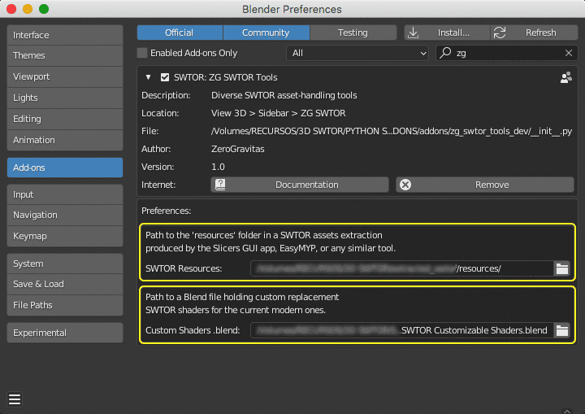
	* **Path of a "resources" folder**: some of the Add-on's features depend on looking for information and game assets inside a SWTOR assets extraction (typically produced by apps such as SWTOR Slicers or EasyMYP). In the case of a SWTOR Slicers extraction, the "resources" folder is inside the folder set as that app's Output Folder.
	
		Click on the folder icon to produce a file browser dialog window where to locate the "resources" folder, or type or copy its path inside the folderpath field.
		
	* **Path to a Custom Shaders .blend file (if any)**: only required by a couple of tools that allow us to replace the current .gr2 Add-on's modern SWTOR shaders with custom ones held in one Blender file, meant for us to experiment with and improve upon. See: [Custom SWTOR Shaders (beta)](#custom-swtor-shaders). 

		Click on the file icon to produce a file browser dialog window where to select such a Blender project file, like the one linked in the second step of the installation instructions, or type or copy its path inside the filepath field.
        
The Add-on's tools will appear in the 3D Viewport's Sidebar ('n' key), in the "ZG SWTOR" tab (plus a few specific tools in the Shader Editor's Sedebar, too).

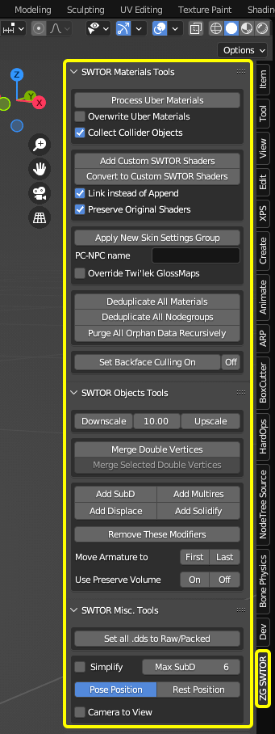

The current tools are:

 

## SWTOR Materials Tools:

 

### Process Uber Materials.
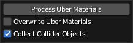

**Requirements:**
* **Selecting a "resources" folder in this Add-on's preferences settings.**
* **An enabled SWTOR .gr2 Add-on, be it the Legacy Add-on or the current modern one.**
* **A selection of objects.**

This tool processes all the Uber-type materials detected in a selection of objects, locating their related texturemaps and linking them to a SWTOR Uber shader (modern or legacy, whichever is active). It processes any EmissiveOnly-type (glass) materials, too. It's particularly fast, as it (only) works with an asset extraction's "resources" folder.

Options:
* **Overwrite Uber Materials** (off by default): overwrites already present Uber and EmissiveOnly objects's materials, which allows for regenerating materials that might have lost texturemaps, for converting Uber materials from Legacy to modern and viceversa, etc.
* **Collect Collider Objects** (on by default): adds all objects with an "Util_collision_hidden" material type or texturemap to a Collection named "Collider Objects".

**It needs the presence of an enabled [SWTOR importer Add-on ("io_scene_gr2")](https://github.com/SWTOR-Slicers/Granny2-Plug-In-Blender-2.8x)** in Blender, either the latest version or the [**Legacy**](https://github.com/SWTOR-Slicers/Granny2-Plug-In-Blender-2.8x/releases/tag/v.3.0) one, as it uses their Uber materials. In the case of the Legacy materials, importing any throwaway game object might be needed in order to generate the required material template if none are there.

This tool also produces a simplistic glass material, Principled Shader-based, for EmissiveOnly-type materials such as those in spaceship windows.

As some sets of objects, such as spaceship interiors, can easily have a hundred materials or more, Blender might look like being unresponsive while processing them. Its progress can be followed in Blender's Console output, which will show the objects and materials being processed. Some error messages are prone to appear in the console, due to some unintended interactions with the modern version of the SWTOR Importer Add-on: those are expected, and don't affect the final result.

**If a selected object's material is shared with objects that haven't been selected** (and that's very typical in architectural objects like spaceships or buildings) **they'll show those processed materials, too, as if they would have been included in the selection.** This is their expected behavior. If needed, the way to avoid this would be to isolate the material we don't want to be processed by changing its name to one that doesn't exist in SWTOR's shaders folder.

 

### Customizable SWTOR Shaders.

**THIS FEATURE IS IN A BETA STAGE. It shouldn't break anything but itself at its worst, though.**

**Requirements:**

* **Blender 3.x** (Blender 2.8x-9.x support coming soon).
* **Selecting a custom SWTOR shaders-holding .blend file in this Add-on's preferences settings.**
* **An enabled latest version of the SWTOR .gr2 Add-on, only needed at the very moment this tool is being used (supporting the Legacy one is being considered).**
* **A selection of objects.**

As convenient as our modern, *smart* SWTOR shaders for Blender are, especially for the novice (no dangling texturemap nodes, not having to manually adjust Material or texturemap images' settings, no risk of overwriting template materials), they are a little harder to customize than the previous, now Legacy ones. Both versions, being generated programmatically (the .gr2 Add-ons' code produce them on the fly while importing SWTOR object files), are harder to customize in a reusable manner, too: most modifications can be done once applied to objects, but those modifications have to be redone or copied (if feasible) between projects.

So, what we've done here is two things:

* We've "dumbed down" the modern shaders: no smarts, the texturemap nodes are back to dangling from the SWTOR Shader nodegroups (so allowing to interpose color correction nodes and stuff as usual), no automatic adjustment of texturemap images and materials' settings (although the converter tool has that sorted).
* Instead of having an Add-on code generate the shaders on the fly, the shaders are stored in a .blend file, and the Add-on replaces the normal modern shaders with these dumb ones, placing the involved texturemaps' nodes alongside and linking them correctly.

What are the advantages to this?

* The most important one is that any modifications to this SWTOR shaders "library" Blender file can be tried and saved quickly just by playing in that Blender project. What's more: if we choose to have the Add-on replace the modern shaders in a given object with these dumb ones by **linking** to them instead of **appending** them, any improvement done to the shaders in the future will become available to older projects using linked shaders automatically. And if we need to do a per-project custom work, we can always convert a linked shader into a permanent one (with Blender's Make Local option).
* **These customizable shaders can coexist with the modern, automated ones**. What's more: one can keep both in a given material and alternate linking them to the Material Output node for comparison sake (or by putting a Mix Shader in-between) or as a backup of sorts.
* We can even maintain several differentiated SWTOR shader library files at once, to try different approaches without compromising previous projects. As the data on where each linked shader comes from is stored in the Blender projects using them, we can keep several library files with different names and just set the one we want to link to or append from in any given moment in the Add-on's preference settings. Some care would be needed, such as not moving those library files around or we will have to reconnect them, and maybe keeping a sensible naming scheme. Just the usual)
* Finally: this setup makes comparing notes extremely easy, just by sharing our library .blend files between fellow hobbyists.

So, how does this work on a practical level? The available tools are:

#### Add Custom SWTOR Shaders:
This tool is only needed if we want to add the shaders to a Blender project that has no previously textured SWTOR objects we could just convert. It simply adds them to the currently open Blender project: they'll become available through add > Group submenu (the ones in the add > SWTOR submenu are the usual modern shaders, instead). This tool is disabled if we happen to be editing the .blend file we selected as a library in the Add-on's preference settings, to avoid accidental duplications or loopbacks. Its options are:

* **Link instead of Append**: as explained, Append adds a fully modifiable copy of the shaders. Link, instead, inserts instances of the shaders stored in the library .blend project. We can adjust their settings normally, but we won't be able to modify the nodes inside their nodegroups. There are ways to edit both the library and the working project at once, by using two instances of Blender, each opening each file, and saving-and-reverting the working project every time we save a change in the library one.

	This option is on by default except when editing a library file, in which case it wouldn't make sense to use linking.

#### Convert to Custom SWTOR Shaders:
**Doesn't require to previously use the Add Custom SWTOR Shaders: it does that by itself.**

It goes through all the materials in a selection of objects, detects the presence of the modern SWTOR shaders, and inserts the customizable versions with the same settings plus the needed texturemap nodes. Its options are:

* **Link instead of Append**: it works exactly like in the previous tool.
* **Preserve Original Shaders**: it doesn't delete the original modern shaders, simply pushing them aside inside the material, unlinked. If anything were to go wrong sometime further on in our experimentations, we can always unlink the customizable ones and relink the originals. This option is on by default.

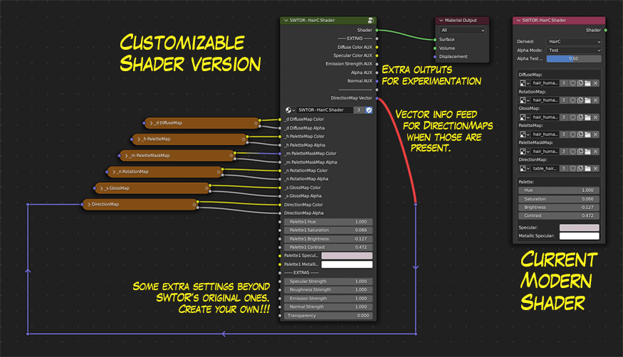

We can regenerate the customizable shader in a material by deleting it and its texturemaps and Converting the material again, as long as the original shader still exists in it. That's why preserving them is on by default.

#### About the included custom shaders:
Alongside this Add-on's .zip file, there comes a sample .blend file holding just the customizable shaders. It can be renamed and stored wherever however and wherever we want, although we should decide a stable location for it and its derivatives, as moving it somewhere else after being applied in linked mode would lead to having to tell each Blender project using it where it was been moved to.

The only rule for the [**Convert to Custom SWTOR Shaders**](#convert-to-custom-swtor-shaders) tool not to fail is to keep the names of the shaders intact. These are:

* SWTOR - Uber
* SWTOR - Creature
* SWTOR - Garment
* SWTOR - SkinB
* SWTOR - Eye
* SWTOR - HairC

All the auxiliary custom shaders inside their nodegroups have been renamed by adding a "SW Aux - " prefix (e.g.: "SW Aux - ManipulateHSL"). Such renaming helps us avoid conflicts with the original .gr2 Add-on's own shaders, as we might want to modify the auxiliary shaders, too (some are already modified). Strictly speaking, in the case of these auxiliary shaders, they only need to have different names to the originals. it's in the main ones' case where we need to keep the names stated above.

These shader library Blender projects don't need to be kept empty of objects and texturemaps. Actually, the most convenient thing to do would be to populate them with objects representative of the shaders' usage, so that we can try stuff on them. Say, some ship interiors for the Uber shader; some animals for the Creature one; Player Characters of diverse species for SkinB, HairC and Eye, some armor sets for the Garment shader… I haven't pre-populated the downloadable sample project in this repository because of both copyright-related reasons and file sizes.

#### Custom Shader Extras:
Just as a first example of adding custom stuff to the shaders, the ones included in the .blend file come with a few extras already, not just in their inputs and settings but in their outputs, too. They are rather tentative and far from perfect, mostly a suggestion of what can be done.

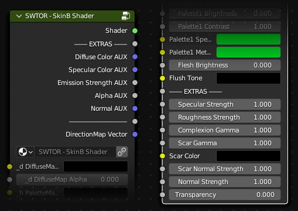

Extra Inputs, in most shaders:
* **Direction Map**: a DirectionMap provides with a kind of colorful anisotropic (directional) gloss that is applied to hairs, the skin and fur of some species (such as Cathar and Nautolan) and creatures, and even in weapons. As it requires feeding them some vector information calculations, the shaders able to use it output such vector data as an auxiliar output to be linked to these texturemap nodes' vector inputs. This Add-on's converter tool does that for us.

  It's been tested in hairs and creatures so far. TORCommunity.com's Character Designer doesn't annotate the DirectionMap data in the paths.json file it saves inside the character's .zip file, but when collecting the assets it copies in each material subfolder a .mat file that has the DirectionMap's filepath. By opening it with any text editor we can read that data and locate them. They are stored in `resources\art\lookuptables`.

  (I should point out that this way of doing things, this pseudo-circular linking, is a little dubious, Blender-wise. In fact, Blender is complaining by thickening the returning link and painting it orange. It's not a true circular relationship, though: the mapping calculations as such don't feed the shading ones, and it simply *does work*. Still, I might end up having to bring the calculations outside, which would make the material's node arrangement rather messier)

* **Specular and Roughness strength**: All shaders have them. They try to simulate the Principled BSDF shader's settings of the same name, but don't work in exactly the same way.

  The .gr2 Add-on's modern shaders, instead of using Blender's Glossy shader or the Principled BSDF one (save in one specific case) to produce glossiness, replicate the way SWTOR calculates it and adds it to the diffuse color before feeding it to a diffuse shader (which is one of the reasons baking textures with them requires presents some problems).
  
  As I don't fully understand how it works yet and whether producing a PBR specular/roughness-like through it is doable or not while keeping it identical with default values, what I've done is something that *looks like* such functionality by using the roughness strength input to both feed Blender's Glossy BSDF shader's roughness input and crossfade its results with the original SWTOR shading system.
  
  So, instead of the standard roughness range between 0 and 1, here 1 means SWTOR's "natural" results. **Most of these extras assume that 1 means default SWTOR-like**.
  
  As for the specular strength input, it just multiplies the SWTOR-type specular by it, 1 being the game's original look.

  **In the case of the Garment Shader (used for dresses and armor), there are separate specular/roughness inputs for each dyeable area (corresponding to the Palette1 and Palette2 sets of standard inputs) and also for the non-dyeable ones**, as sometimes that's an interesting thing to have.

* **Emission Strength**: for turning glowy bits such as control panels, spaceship windows, armor lights and others far brighter than in the game. In the Eye Shader it only affects species with glowy eyes like the Chiss.
* **Normal Strength**: raised above 1.0, it emphasizes objects's surface relief, if in a somewhat wonky way. It doesn't work terribly great on solid surface objects, but in characters it provides a very striking "**League of Legends: Arcane**" look (which in the series was achieved through hand-painted textures), so, I suspect it's going to be a favorite.

  In the case of the Garment Shader (used for dresses and armor), there are separate Normal Strength inputs for each dyeable area and also for the non-dyeable ones.

* **Transparency**: this is a global material transparency factor, unrelated to any opacity map in the material. Its main mission is to allow us to invisibilize a part of an object, such as the feet of a Player Character that has been turned into a single mesh and happens to be poking through its boots.

A few additional, shader-specific inputs:

In the **SkinB Shader**:
* **Complexion Strength**: it controls the contrast of a character's complexion texturemap without the need for the old trick of switching its Color Space to sRGB or interposing some color correction node. Internally, it uses a Photoshop's Levels-like Gamma value.
* **FacePaint Strength**: it's a mixing value for a character's make-up, tattoo, pattern and others in the FacePaint texturemap. Not only allows for fading those but it can be raised above 1 and give their alpha channels more density and, so, more opacity, especially in cases like tattoos where the alphas aren't fully opaque but a little transparent and noisy to suggest skin detail underneath.
* **Multiplied Tattoos Color, Mask, and Strength**: these are a simpler way to make tattoos that works very well with Blender's 3D texture painting system. Instead of using images with alpha channels to stamp make-up or tattoo images over the base skin texture, it applies them in the style of Photoshop's Multiply layer transfer mode. At its simplest, we choose a color (say, black), load a greyscale image as the mask, and adjust its opacity to taste. As it's not an opaque layer but a multiplied one, it ought to reinforce all the skin texture detail underneath. And, being the mask a simple greyscale image instead of the alpha of a RGBA one, it's easier to use by the 3D painting system in Blender. White or grey in the mask means ink, just as SWTOR's FacePaint alpha channels do, but that could be changed if you feel it's counterintuitive.

  It can be made more complex by using a multicolor texture in the color input. The thing is, its colors ought to mix in a manner more tattoo ink-like than using the FacePaint system.
  
  This Multiplied tattoo layer sits under the FacePaint one, so, one can use both at once.
* **Scar Strength, Color and Normal Strength**, to adjust scars and age maps in intensity (Gamma), color, and appearance of bumpiness through Normal map strength.
* **Skin Pores Density, Strength, and auxiliary Holdout Mask**: it's a Voronoi noise-based bump effect that simulates skin pores with a certain amount of success. It takes advantage of other already existing texture channels to attenuate its effect in regions of the face where it's obvious it doesn't work too well, like the lips, and it's mostly an illusion of skin pores that holds up if one squints a lot 😅.

  A problem with its Density input is that such density is dependent on the object's base size (independent of object scaling): for example, a head object will need a far lower density figure than a joined single mesh full body. Experimentation is advised.
  
  As the diverse channels of information in SWTOR's textures can only do so much in a generalized way, there is a Skin Pores Holdout Mask that allows for manually (or through custom channel mixing trickery) protecting areas of sking from the pores effect. For example: if we use the blue channel of a Devaronian's PaletteMaskMap (`_h`) texturemap and contrast it a little, we can isolate the horns and keep them from showing pores. Black or dark occludes the effect.

In the **Eye Shader**:
* **Emission Strength**: as mentioned, it only shows its effects in species with naturally glowy eyes like the Chiss.
* **In-Shadow Compensation**: as it is easy for the eyes of a character to get lost inside the face's shadows, this allows for adding a bit of emissiveness to compensate.
* **Dark Side Glow Strength and Tint**: Sith Glowy Eyes!!! As it is done right now, it uses as a base the character's eye texture without the re-color that the character uses, as most eye textures have warm colors that will give the typical Sith glowy amber look when mixed in. Still, there is a tinting color well for finetuning or completely altering the effect: to cancel the tinting, just set the color's saturation to zero (either the S of HSV to zero, or all RGB to equal values).
* **Normal Strength** in the Eye Shader doesn't do much. It's there for consistency, and at best it displaces the reflections in the eye a little. Ideally, we would add an anime-like pupil system and specific controls for that. We'll see. 

Extra Outputs:
* **Diffuse Color AUX**: the diffuse color in RGB, with the PaletteMap re-hue already applied!
* **Specular Color AUX**: the specular color on black, in RGB. Typically, one would mix it with the diffuse in Add mode.
* **Emission Strength AUX**: it's the emissive channel from the _n RotationMap.
* **Alpha AUX**: it's the opacity channel from the _n RotationMap.
* **Normal AUX**: this is the Normal information, already processed to be directly usable in any Blender node that we could want to chain to the rest of the shader's outputs.

These channels are mostly there for experimenting with adding our own node trees for things like, say, trying comic book or anime-like Non Photorealistic Rendering (NPR), or maybe to produce baking information.

* **DirectionMap Vector**: as DirectionMaps require pre-calculated data that is internally generated in the automatic modern shaders, this is a bit of a kludgey way to produce that information and link it to the DirectionMaps' vector input. The Converter tool adds those links by itself. Even if such setup looks like a looping circuit, it really isn't. Blender seems to tolerate it well.

#### About the beta state:
The Add-on, as it is now, needs work in things like failing gracefully to errors, providing support for older Blender and .gr2 add-on versions, refining the existing extra features (for example, per dye area-Spec/Rough/Emissive/Normal strength settings), and most probably rearranging the shaders' node trees into something a bit more wieldable.

That said, I should point out that these shaders, as such, are meant to be further customized and evolved by any of us based on our particular interests. For example, the current implementation of glossiness is meant to replicate SWTOR's own, but someone might prefer to discard that and do their own Blender Specular node or Principled BSDF node-based one, or substitute SWTOR's Flush Tone-based pseudo-subsurface scattering effect with Blender's own, add adjustable noise-based skin pores, etc.

The downloadable shader library file is just an example of a starting point. The sky is the limit.

 

### Character's Skin Settings "control panel" Nodegroup.

**Requirements:**

* **Blender 3.x.**
* **Skin materials using the Customizable SWTOR Shaders.**
* **A selection of objects some of which use such materials.**

This tool applies to a series of SkinB Shader-using materials a Nodegroup holding common values to such materials, so that a change in such Nodegroup affects them all at once and saves time. It needs to use the Customizable SWTOR Shaders, as the normal modern SWTOR Shaders' user interface doesn't accept inputs from other nodes or nodegroups.

Managing a Player Character or a NPC's skin materials is rather cumbersome, as we can have to handle up to five at once. Any character-wide change we might want to make involves copy-pasting values like recoloring palettes, specular colors, extras such as skin pore densities between those materials, etc.

We can take advantage of Blender's Nodegroups by storing all those values in one such Nodegroup per character and have it pass them to the customizable SWTOR SkinB shaders involved.

This tool has two versions: a fully automated one in the 3D Viewer, and another that allows for applying its steps manually. The way they work is as follows:

#### In the 3D Viewer:

  We type a name for the Nodegroup we want to generate (typically the character's name) in the **PC-NPC name** field, and select the objects of a character (all of them or just some specific ones).

  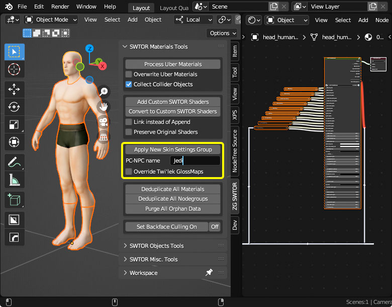

  Upon clicking the **Apply New Skin Settings Group** button, the Add-on will:
  1. Create a Skin Settings Nodegroup labelled folloing a "NAME's Skin Settings" scheme. It is important not to ever delete the "Skin Settings" part of the name, as that will allow for further automation in the future.
  2. If it finds among the selected objects any material containing the word "head", it'll copy all the non-texturemap values in the material's SkinB Shader to the Nodegroup. If it doesn't it will copy any other skin material.
  3. Will add an instance of the Nodegroup to every skin material and link its outputs to the SkinB Shader's inputs.
 
     (If the **Override Twi'lek GlossMaps** checkbox is ticked, it'll unlink the GlossMap texturemap nodes and link instead common Nodegroup values to those. This is meant to be used for Twi'lek characters, as BioWare did something to their glossiness maps that produces noticeable diferences in shininess between their heads and the rest of their bodies. It's clearly visible ingame.

  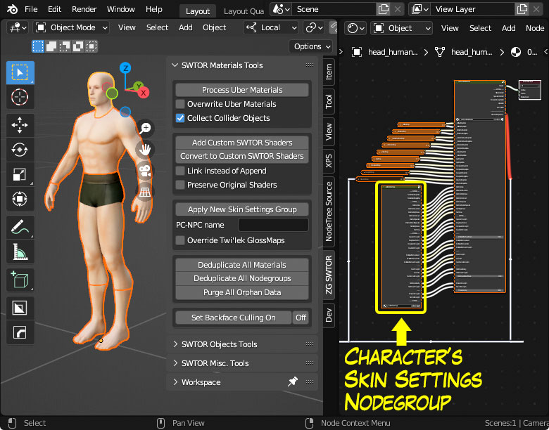

  To modify the character's skin settings, we just need to enter the Skin Settings Nodegroup present in all the involved Skin materials (or by using some Add-on that lets us jump directly into any Nodegroup in the Blender file, such as [**Greg Zaal's excellent Matalogue Add-on**](https://github.com/gregzaal/Matalogue)) and begin tweaking values, watching how all the skin parts react at once.

  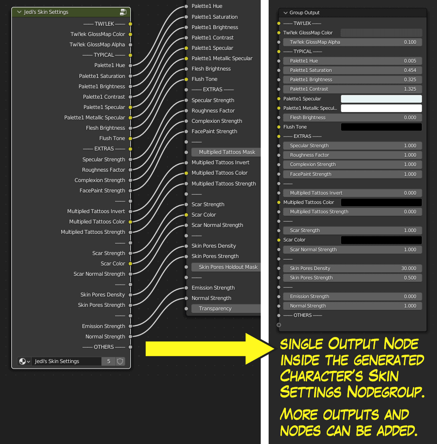

Something to note is that, once created, we can add our own fields to the bottom of the Nodegroup. For example, we might add hair recolor palette values and manually add the Nodegroup to the hair materials and link such values to the relevant HairC Shader inputs. We could add more nodes inside to build more complex data, such as noise generators to produce FacePaint (tattoo, make-up, etc.) patterns, etc.

**This Nodegroup is stored as a template in the custom_swtor_shaders.blend file**, named "SW Template - Character's Skin Settings". This tool makes local duplicates of it, so that they stay stable, unique to the working Blender project. That said, they are just normal Blender Nodegroups that we can add to non-skin materials for using some data from it anyway, or append or link to other projects (which wouldn't even be necessary when importing a character from other project into a new one, as Blender brings with it all the necessary Material information).

  What's important about this detail is that one can do those custom additions to the Skin Settings Nodegroup to the customizable shaders library Blender project, so that all applications afterwards add such additions.

#### In the Shader Editor:

  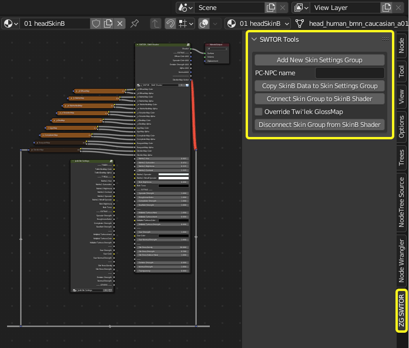

  Most of the same functionality is available in the Shader Editor, too, if separated in pieces. We can:

* Add (create) a new named Skin Settings Nodegroup.
* Copy a selected SkinB Shader's information to a present Skin Settings Nodegroup (requires selecting the Nodegroup, as we might have several present for, say, comparing a few different combinations of settings).
* Connect a selected Skin Settings Nodegroup to the SkinB Shader, all links in one go. Includes the Twi'lek specific variation checkbox.
* Disconnect those links (just the equivalent to using Blender's Blade tool).
  
  With those, we can have some extra flexibility in all this.

Ideally, we would have some kind of menu for selecting and applying already existing Skin Settings Nodegroups in a more elegant manner… but I'm still learning how to 😅. Anyway, plans for the future include doing something similar for the Garment and HairC Shaders, and maybe simpler Dye Settings Nodegroups. We'll see.

 

### Deduplicate Scene's Materials and Nodegroups.
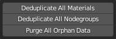

**Requirements: none.**

Consolidates all duplicates of a node or a material in the scene ("node.001", "node.002", "material.001", etc.) so that they all become instances of a single original instead of independent ones. The copies are marked as "zero users" so that, after saving the project, the next time it is opened they will be discarded. They can be eliminated more immediately by purging all orphan data in the Blender project file, although one must be sure of not having any other zero users data of any kind that might be unintendedly deleted alongside. This purger button is the same as the one at the Outliner's Orphan Data view, but it works in recursive mode (it cycles through the operation until there is no orphan data left. It seems Blender will set that mode as default in newer releases).

* It acts on all the nodes of a scene, so, it doesn't require a selection of objects.

 

### Set Backface Culling On/Off.
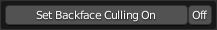

**Requirements: use Eevee in the 3D viewport for the effect to be visible.**

It sets all the materials in the selected objects' Backface Culling setting to on or off (the setting is fully reversible). Many SWTOR objects, especially floors, walls, and ceilings of spaceships and some buildings, are single-sided by nature, which ought to make their sides facing away from the camera invisible. Blender, by default, renders single-sided objects as double-sided unless Backface Culling is enabled.
* It **doesn't** depend on the presence of a .gr2 importer Add-on: this setting works in any kind of Blender material, no matter if SWTOR-based or any other kind.
* **The setting only acts through the Eevee renderer** (either while in Viewport Shading mode or as a final renderer). Cycles enforces double-sidedness, no matter if we tick the Material Properties Inspector's Backface Culling checkbox. If the intention is to do the final render through Cycles, a dual 3D Viewer setup, one in Material Preview mode (Eevee) and the other displaying the Render Preview might be the best way to finetune lighting and texturing. 

The usefulness of this tool becomes apparent when having to deal with interior scenes such as spaceship rooms, where we have to place models (characters, furniture, props.) while having the walls and ceilings occluding our view. There are cumbersome solutions to that, such as hiding polygons, playing with the camera clipping settings, or using a booleaning object to "eat" walls or ceilings away. This is simpler and faster. Also, it doesn't affect the rendering when placing the camera inside, as in there the one-sided objects are facing the camera in the intended manner.

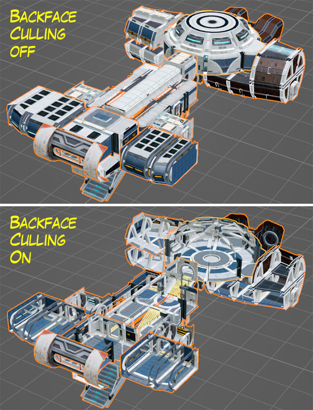

When assembling multi-object locations, it's typical that a same material is shared between several objects. That can lead to unselected objects showing the effects of this tool as if they would have been included in the selection. This is an expected behavior. The only way to avoid this would be to isolate the material we don't want to be affected by changing its name.

## SWTOR Objects Tools:

### Quickscaler.
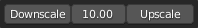

**Requirements: a selection of objects.**

Scales all selected objects up or down by a factor, preserving their relative distances if their origins don't match. The idea behind the tool is to be able to quickly upscale all objects of a character or a scene to real life-like sizes (1 Blender unit = 1 m. or equivalent), as Blender requires such sizes to successfully calculate things like automatic weightmaps, physics simulations, etc.

**Cameras, lights and armatures are correctly scaled, and it acts only on non-parented and parent objects**, to avoid double-scaling children objects (typically, objects parented to a skeleton). **Objects set as insensitive to selection operations in the Outliner aren't affected by this tool**.

Any number between 1 and 100 can be manually entered. Recommended factors are:
* 10, for simplicity. It results in rather superheroically-sized characters.
* Around 7-8 for more realistic human heights.

 

### Merge Double Vertices.

**Requirements: a selection of objects.**

Merges "duplicate" vertices (applies a "Merge By Distance" with a tolerance of 0.000001 m.), which usually solves many issues when fusing body parts or applying Subdivision or Multiresolution Modifiers to any SWTOR object.
* Requires a selection of one or several game objects.
* When selecting multiple objects, the tool acts on each of them separately so as not to merge vertices of different objects by accident.
* To correct any possible normals problems derived from the operation, it performs a face area normals' averaging operation, too.
* Also, it sets each object's Auto Smooth to On (it's typically on by default, but, just in case…).
If we intend to subdivide objects such as weapons or some bits of armor that happen to be very simplistic, I suggest to test that subdividing immediately after merging doubles to check that there won't be problems that require additional massaging. That, or keeping non-merged duplicates of the objects, just in case we have to backtrack. 

 

### Modifiers Tools.
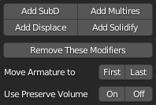

**Requirements: a selection of objects.**

They add to all selected objects Modifiers like Subdivision or Multires (for hiding SWTOR's models' low poly nature) and Displace and Solidify (to facilitate gear-over-full body workflows), with sensible settings as an easy starting point. There is a Modifiers removal button that only affects those Modifier types, preserving any other, such as the Armature modifier that results from parenting a skeleton. Also, there are buttons for moving such Armature modifiers to the top or the bottom of the Modifier Stack, and for ticking their "Preserve Volume" checkboxes, for both usefulness and experimentation.

* Requires a selection of one or several game objects.
* The Armature Modifier re-ordering buttons don't work by selecting Armature objects yet: only by selecting objects that have received Armature Modifiers. The former functionality will be considered for an update.

 

## SWTOR Misc. Tools:
Minor tools. Some of those these are simply a few already existing Blender tools that are a little too buried inside their panels and would be nice to have more at hand.

 

### Set all .dds to Raw/Packed.

**Requirements: none.**

It sets all images in the blender project whose names end with the .dds extension (as is the case in SWTOR's texturemap images) to Color Space: Raw, and Alpha: Channel Packed, which are the settings our SWTOR shaders expect in order to work properly.
* It acts on all the images of a scene, so, doesn't require a selection of objects.

(It's typical to set some texturemap images, such as complexion maps, to sRGB because that makes them appear a little bit darker, something that this tool would revert. Such trick should be no longer necessary by using the new customizable shaders' extra Complexion Gamma settings).

 

### Simplify.
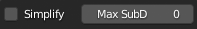

**Requirements: none.**

Already available in the Properties Editor > Render Properties > Simplify section, this tool lets us temporarily switch a few common and somewhat costly options, such as Subdivision Modifiers' levels, number of particles, etc., to lower values, at the scene level. For example, we can disable subdivision while animating a character, which will make its meshes react to our posing far faster.

 

### Pose Position / Rest Position.

**Requirements: a selection of objects including an armature.**

It shows the Pose Position and Rest Position buttons already available at the Properties Editor > Object Properties > Skeleton section when a skeleton is selected, letting us quickly alternate between those two states. It only acts on the Active armature (the Active Object that happens to be an armature at the moment) instead of all selected armatures. Having it act on all of them is in the works.

 

### Camera to View.

**Requirements: none.**

Same checkbox as the options panel's View Tab > View Lock section > Lock Camera to View, for easily switching from framing the scene from the camera POV to keeping the camera unaffected while navigating the viewport.
