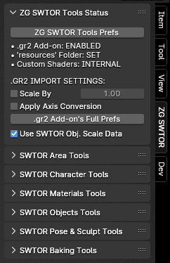

# ZeroGravitas' SWTOR Tools.

* ### Requires [Blender 3.6.23](https://www.blender.org/download/lts/3-6/) (last LTS release in that series) as a minimum.
  Sadly, during 3.6.x' run, a bug regression in Blender nuked our SWTOR shaders' custom panels, making the supporting of these add-ons a real chore. **We *really* need you to be up to date with your Blender LTS editions' minor versions** (the third number, such as 3.6.**23**). 

  This regression has occurred in other series, such as 4.0.x and 4.1.x (which were *terrible* due to their transitional state). Generally we try to be compatible with them all but, realistically, we can only offer support for LTS Blenders (3.6, 4.2, 4.5, soon 5.2), and their very latest minor versions, at that. 
* ### The Character Assembler tool is now compatible with Jedipedia.net's new NPC exporter (using the matched version of the [.gr2 Importer Add-on](https://github.com/SWTOR-Slicers/Granny2-Plug-In-Blender-2.8x/releases/latest) included in this one's release page).

  As Jedipedia exports plain JSON files instead of a zipped enclosing folder, it is recommended to put the file in a folder of your own. The add-on will create the appropriate Models and Materials subfolders inside instead of carelessly dropping them around.

  At the moment no skeletons are gathered: we have to find them manually. This will be solved ASAP.
* ### Compatible with Game Update 7.6 and higher's Modernized PC/NPC skin textures.

  Depending on which resources folder is selected in the add-on's Preferences (extracted before or after Game Update 7.6), the tool gets the correct classic or modernized results. Check the Character Assembler tool's guide for details.

---

**This Blender Add-on provides with a miscellanea of tools to import, assemble, texture and improve upon Star Wars: The Old Republic's game assets. It grows in features as new ideas come up. Quality of code-wise, "this is not a place of honor": It Just (Kinda) Works™.**

This Add-on relies on foundational efforts by fellow slicers, such as the **[.gr2 Importer Addon](https://github.com/SWTOR-Slicers/WikiPedia/wiki/ZG-SWTOR-https://github.com/SWTOR-Slicers/Granny2-Plug-In-Blender-2.8x)**, which is invoked under the hood in places, and the **[ExtracTOR](https://github.com/SWTOR-Slicers/WikiPedia/wiki/Installing-Slicers-GUI-and-extracting-SWTOR-game-assets)**, **[Slicers GUI](https://github.com/SWTOR-Slicers/WikiPedia/wiki/ZG-SWTOR-https://github.com/SWTOR-Slicers/Slicers-GUI)**, and even ancient **TorMYP/EasyMYP** tools, which let us extract the game assets we play with, to start with, plus game information exported by tools in **[Jedipedia.net](https://https://swtor.jedipedia.net/en)** and **[TORCommunity.com](https://torcommunity.com/)**.

### Check the [ZG SWTOR Tools' pages in our Wiki](https://github.com/SWTOR-Slicers/WikiPedia/wiki/ZG-SWTOR-Tools-Add-on) for installation instructions and each tool's user guide.

 

## Recent changes:
2026-07
* Support for Jedipedia.net's new NPC JSON export: it accepts .json files with arbitrary names, and handles missing skeletons without crashing.
* We are imposing Blender 3.6.23 LTS as the minimum required version of Blender, to avoid regressions and bugs out of our control that crash our tools.

2025-02

* Support for SWTOR Game Update 7.6's modernized skin materials.
* Support for the improvements in the .gr2 Add-on's NPC support.
* Bug corrections in the Objects/Skeletons/Materials' names prefixer and Merge Physics tools.

2024-09

* Minor corrections in the Merge Doubles (Edit Mode) tool for compatibility with Blender 4.1 and higher.

2024-07:

* Compatibility with Blender 4.0.x (depends on the .gr2 Importer Add-on's own compatibility).
* The Add-on interacts with the .gr2 Importer Add-on's new features, exposing some of them in the Status Panel. Several Objects Tools use them (see Object Tools page's prologue).
* Area Assembler:
  * Corrects a bug in its instancer code (responsible for duplicating already imported objects to speed up assembling): now **more objects ought to land in their correct places** instead of ending up floating around at random.
  * **Terrains no longer show fissures thanks to an improved SWTOR Terrain Extractor. please download it and regenerate your terrains with it**.
  * **NEW: It assembles 64-bit SpeedTrees** now, filling a Tython or a Dromund Kaas with trees.
  * **Makes sure whole imported areas are consistently placed relative to the scene's origin**. In theory, merging partial Area Assemblies into a final scene wwith everything fitting correctly ought to be possible.
* Group Areas in Subcollections: works far better and easier now.
* Character Assembler (in combination with improvements in the .gr2 Importer Add-on):
  * Solves an issue with NPCs' skin areas showing armor material instead of skin.
  * **NEW: it pplies DirectionMaps to hair and fur**.
  * Corrects an issue with Twi'lek eyes' UVs that kept them from baking correctly.
  * **NEW: it can separate the eyes into a different object**, which some third party rigging systems prefer.
  * **NEW: it can make each eye a separate object**, adjusting their origins so that we can control them with both bones and conventional rotations at once.
* **NEW: Merge Physics Bones' Vertex Groups**: helps with Cloth Physics applications.
* **NEW: Set Objects' Properties Manually**: for management of .gr2 object properties (nothing to see here, move along).
* **NEW: Clear bone Translations**: to solve imported animations and poses' distorted limbs.
* **NEW: Correct Twi'lek eyes' UVs.**: same as in the Character Assembler, but applicable to already imported models.
